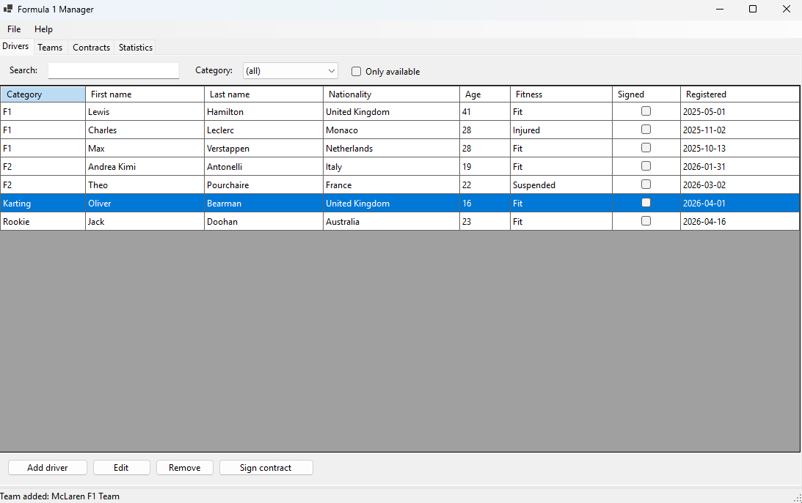
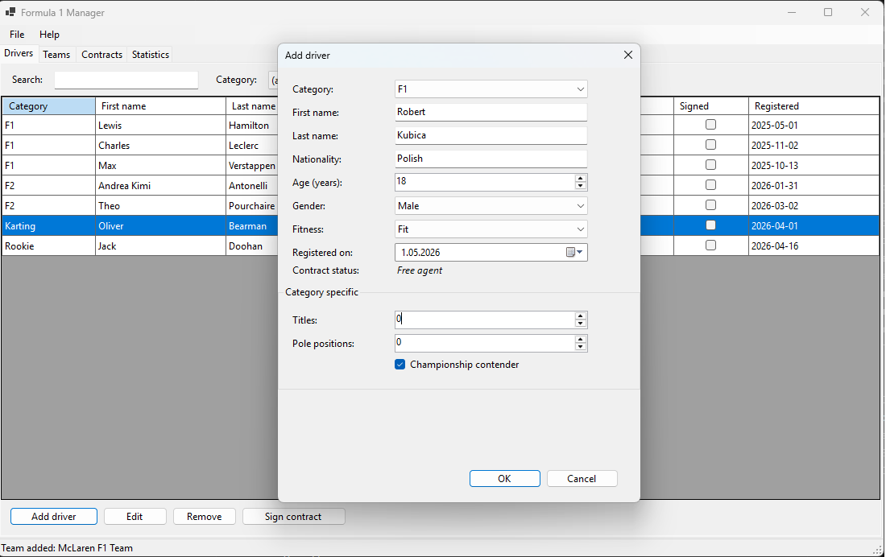
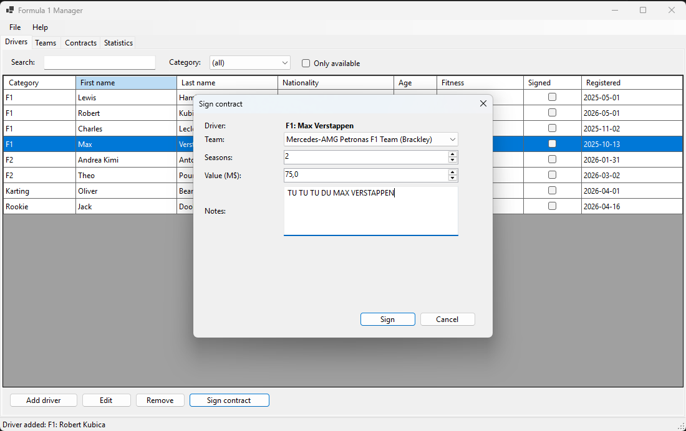
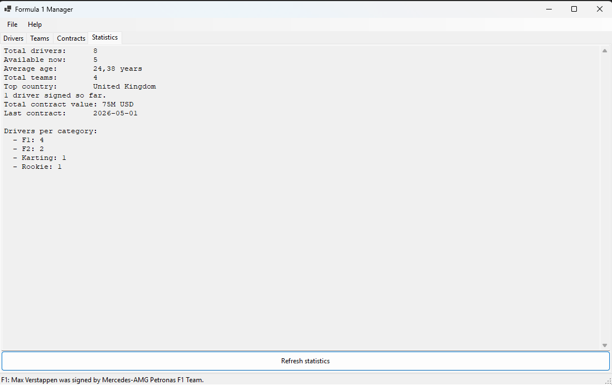
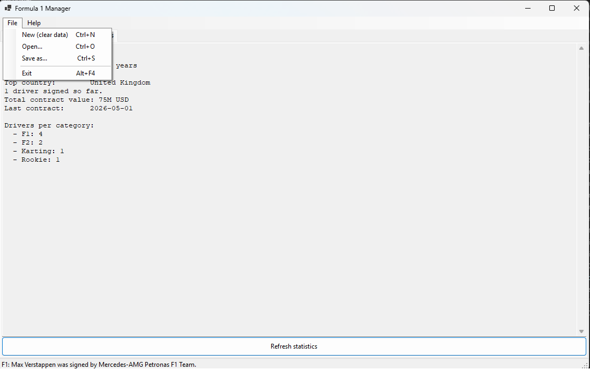
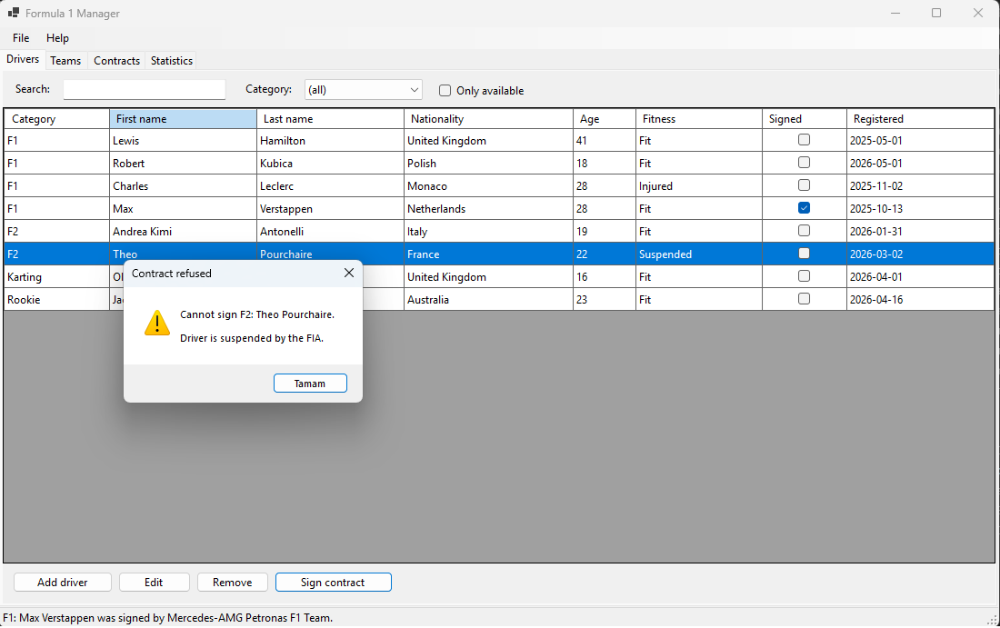
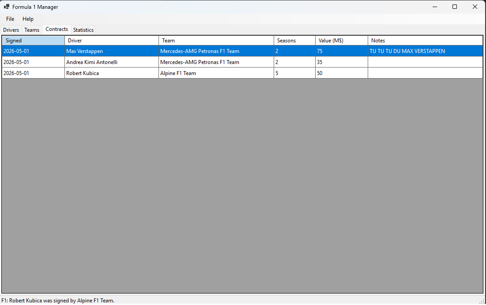
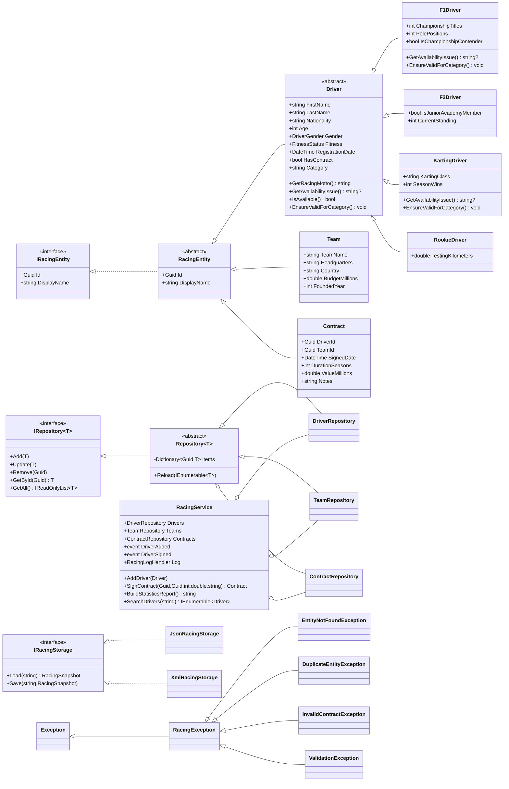

# Formula 1 Manager
## Documentation – Advanced Programming, Lab 8 / 9

---

## 1. Title and author

**Application title:** Formula 1 Manager
**Author:** Süleyman Efe Metik
**Course:** Advanced Programming
**Lab:** 8 / 9 – "Pole do popisu"
**Lecturer:** dr Łukasz Marchel
**Submission date:** 02-05-2026

---

## 2. Introduction

Formula 1 Manager is a Windows desktop application that helps a fictional motor
sport management company keep track of the drivers it represents, the racing
teams those drivers can be signed with, and the contracts that bind them.

The domain has three first-class concepts:

* **Drivers** – belong to one of four categories (F1, F2, Karting and Rookie).
  Each category has its own attributes (championship titles, junior academy
  membership, karting class, testing kilometres, …) but they all share a common
  interface.
* **Teams** – the F1 constructors that can sign a driver (e.g. Mercedes,
  Ferrari, Red Bull, McLaren). Each team has a name, headquarters, country,
  budget cap and founding year.
* **Contracts** – every signing produces a contract record that links a
  driver to a team for a chosen number of seasons and at a given monetary
  value.

Through the application the user can add, edit and remove drivers and teams,
sign contracts that are validated against business rules (a driver who is
already under contract, medically unfit, suspended or fails a category-specific
age rule cannot be signed), search and filter the driver list, see live
statistics computed via LINQ, and finally save / load the whole state to JSON
or XML files from the application's main menu.

The project showcases every construct asked for in the assignment: abstraction
layers, polymorphism, custom exceptions, delegates and events, LINQ queries,
generic types, extension methods, and persistence through XML / JSON
serialization triggered from a `MenuStrip`. On top of that the domain enforces
realistic motorsport rules — for example the FIA Super Licence minimum age of
18 for Formula 1 — through polymorphic validation, both at the data-entry
level and at the contract-signing level.

---

## 3. Work division

The project was completed **individually**.

---

## 4. Git repository

The full source code is available at:

> <https://github.com/bensullu/FormulaOneManager>

The repository follows a standard .NET solution layout and contains a single
`main` branch. Each meaningful change is recorded as its own commit so that
the development timeline can be reconstructed from `git log`.

To clone and run the project locally:

```powershell
git clone https://github.com/bensullu/FormulaOneManager.git
cd FormulaOneManager
dotnet build
dotnet run --project FormulaOneManager.App
```

Requirements: .NET SDK 9.0 and Windows (because of WinForms).

---

## 5. Detailed list of functionalities

### 5.1 Driver management

* Add a new driver of any of the four categories (F1, F2, Karting, Rookie)
  through a dedicated dialog. The dialog rebuilds the category-specific
  fields when the user changes the category combo box, so the form always
  matches the picked subclass.
* The age input is automatically clamped to the legal range for the picked
  category: F1 starts at 18 (FIA Super Licence rule), junior karting caps
  at 18, and F2 / Rookie accept any reasonable age. The user therefore
  cannot even type an invalid age in the editor.
* The same rules are enforced again on the service side via the polymorphic
  `Driver.EnsureValidForCategory()` method, so importing data from JSON /
  XML or any future code path also goes through the check.
* The "contract status" of a driver in the editor is **read-only** — the
  contract state can only be changed through the dedicated *Sign contract*
  workflow, which guarantees that no business rule can be bypassed by
  toggling a checkbox.
* Edit an existing driver in place. The category cannot be changed during
  editing because the runtime type is immutable.
* Remove a driver. If the driver still has contract records, the application
  raises a warning dialog and asks for confirmation before deleting.
* Search drivers by partial first name, last name, nationality or category
  (case-insensitive, live LINQ filter on every keystroke).
* Filter drivers by exact category through a combo box that is rebuilt
  dynamically from the current data.
* Toggle "only available" to hide drivers who are injured, suspended,
  retired, already signed or fail a category-specific age rule.
* Per-driver tooltip with the category racing motto (`F1: "Lights out and
  away we go!"`, `F2: "On the road to F1!"`, etc.).

### 5.2 Team management

* Add, edit and remove teams via a dedicated dialog with validation.
* Confirmation prompt and warning if the deleted team still has contracts.
* Budget and founding year are validated (non-negative, sensible ranges).

### 5.3 Contract signing

* "Sign contract" dialog launched from the Drivers tab.
* User picks the team, the number of seasons and the contract value, with
  optional free-text notes from the team principal.
* Business rules are enforced by the service layer through a custom
  `InvalidContractException` whose message **always explains the reason**:
  * a driver who is already signed cannot be re-signed
    ("*Driver already has an active contract with another team*"),
  * an injured driver cannot race
    ("*Driver is currently injured and cannot race*"),
  * a driver suspended by the FIA cannot be signed
    ("*Driver is suspended by the FIA*"),
  * a driver who has retired cannot return
    ("*Driver has retired from competition*"),
  * a driver whose medical exam is missing cannot sign
    ("*Driver has not yet passed the medical examination*"),
  * an F1 driver below 18 fails the FIA Super Licence age rule
    ("*Driver is below the FIA Super Licence minimum age of 18 for
    Formula 1*"),
  * a karting driver older than 18 is no longer eligible for the junior
    series ("*Driver is older than 18 and no longer eligible for junior
    karting*"),
  * the duration must be at least one season,
  * the contract value cannot be negative.
* The reason text comes from a polymorphic `GetAvailabilityIssue()` method
  on `Driver`, overridden by `F1Driver` (age >= 18) and `KartingDriver`
  (age <= 18) – a textbook example of polymorphism producing the right
  message for the right concrete type.
* The same rules also exist as **hard validation** in
  `Driver.EnsureValidForCategory()`, which is called by `RacingService`
  whenever a driver is added or updated. Even if the GUI is bypassed, an
  underage F1 driver or an over-age junior karter cannot enter the
  repository.
* When a contract is signed, the corresponding driver is automatically
  marked as signed, so they immediately disappear from the "available"
  filter.

### 5.4 Statistics

A live LINQ-driven report on the *Statistics* tab shows:

* total number of drivers,
* number of drivers currently available,
* average age,
* number of teams,
* country with the most teams,
* total monetary value of all signed contracts,
* date of the most recent signing,
* breakdown of drivers per category.

The report is recomputed every time the user opens the Statistics tab or
clicks the *Refresh statistics* button.

### 5.5 Persistence (JSON & XML)

* **File → New (Ctrl+N)** clears all repositories so the user can start a
  new season.
* **File → Open… (Ctrl+O)** opens a JSON or XML snapshot. The correct
  storage implementation is selected automatically based on the file
  extension.
* **File → Save as… (Ctrl+S)** writes the current state to JSON or XML.
* Polymorphic deserialization is fully supported: a saved snapshot
  containing `F1Driver`, `F2Driver`, `KartingDriver` and `RookieDriver`
  instances loads back into the correct concrete types.

### 5.6 User experience

* Modern WinForms layout with a `MenuStrip`, a `TabControl` and a
  `StatusStrip`.
* Inline live-search and filters on the Drivers tab.
* Double-click on any row in the Drivers / Teams grids opens the editor.
* Status bar log fed by a custom delegate (`RacingLogHandler`) – every
  add/update/remove/sign action shows up at the bottom of the window.
* Error dialogs catch our `RacingException` hierarchy and present a clear
  message instead of crashing.
* Keyboard shortcuts: Ctrl+N, Ctrl+O, Ctrl+S, Alt+F4.

### 5.7 Reusable / generic library

The `FormulaOneManager.Library` project is intentionally written so that
its building blocks can be reused for any other domain:

* `IRacingEntity` and `RacingEntity` are generic enough to fit any
  `Guid`-keyed entity.
* `IRepository<T>` and `Repository<T>` provide a complete generic CRUD
  implementation for any `IRacingEntity`.
* `IRacingStorage` is the persistence abstraction; two concrete
  implementations (`JsonRacingStorage` and `XmlRacingStorage`) are
  interchangeable.
* `RacingExtensions` exposes generic helpers (`AddRange<T>`,
  `OrderByName<T>`, `CountAndDescribe<T>`).

---

## 6. Pictures and descriptions of interesting parts

The screenshots below are stored in the `screenshots/` folder of the
repository and were captured from the running application.

### 6.1 Main window – Drivers tab



The main window is a `TabControl` with four tabs. The Drivers tab shows
every registered driver in a `DataGridView`, sorted by category and last
name. The toolbar at the top hosts the live search box, the category
filter and the "only available" check. The button bar at the bottom drives
the CRUD actions and the contract-signing flow.

### 6.2 Adding a driver – polymorphic editor with category-aware validation



The driver editor rebuilds itself whenever the category combo box changes,
exposing only the fields that belong to the picked subclass (titles and
pole positions for F1, junior academy membership for F2, karting class
for Karting, testing kilometres for Rookie). This is a direct application
of polymorphism inside the GUI. In addition, the age input is clamped to
the range allowed by the picked category – for an F1 driver the spinner
starts at 18 because of the FIA Super Licence rule, while a junior karting
driver cannot exceed 18. The same rule is enforced a second time at the
service layer through `Driver.EnsureValidForCategory()`, so the constraint
holds even when data is imported from a JSON / XML file.

### 6.3 Sign contract dialog



Triggered from the Drivers tab, the contract dialog displays the chosen
driver in bold, lets the user pick a team, the season count, the value in
millions of USD, and free-form notes. The OK button is wired to the
service which validates business rules and throws a custom exception when
they are violated.

### 6.4 Statistics tab



The Statistics tab renders a textual LINQ-driven report. Every value
(average age, top country, drivers per category, total contract value…)
is computed lazily through chained LINQ operators on the in-memory
repositories.

### 6.5 Saving to disk via the menu



The File menu (built with `MenuStrip`) exposes New / Open / Save as / Exit.
The save and open dialogs filter by both `*.json` and `*.xml`; the format
is chosen automatically based on the file extension picked by the user.

### 6.6 Custom exception in action



Trying to sign a driver who is unavailable triggers an
`InvalidContractException`. The exception message is produced by the
polymorphic `GetAvailabilityIssue()` method on the concrete `Driver`
subclass, so the dialog explains exactly *why* the contract was refused –
for example *"Driver is suspended by the FIA"*, *"Driver is currently
injured and cannot race"*, or *"Driver is below the FIA Super Licence
minimum age of 18 for Formula 1"*. The exception is caught by the GUI's
`TryRun` helper and shown as a friendly error dialog, so the application
keeps running normally afterwards.

### 6.7 Contracts tab with cross-repository LINQ join



The Contracts tab is built with a LINQ `join` between the contracts,
drivers and teams repositories. Even after a driver or team is removed,
the contract row keeps showing "(deleted)" so the audit trail is
preserved.

---

## 7. Class diagram

The diagram below is rendered with Mermaid (visible directly on GitHub).
For a printable PDF or Word version you can either:

* take a screenshot of the rendered diagram on GitHub,
* paste the snippet into <https://mermaid.live> and export to PNG,
* or open `FormulaOneManager.Library` in Visual Studio and use
  *Solution Explorer → View Class Diagram*.



---

## Appendix A – Mapping requirements to source code

| Requirement from the brief | Where it is implemented |
|----------------------------|-------------------------|
| Library + WinForms desktop app | `FormulaOneManager.Library` (class library) and `FormulaOneManager.App` (WinForms project) |
| Abstraction layers and common code base | `IRacingEntity → RacingEntity → Driver → F1Driver/F2Driver/KartingDriver/RookieDriver`; `IRepository<T> → Repository<T> → DriverRepository/TeamRepository/ContractRepository`; `IRacingStorage → JsonRacingStorage / XmlRacingStorage` |
| Polymorphism | `Driver.Category`, `Driver.GetRacingMotto()`, `Driver.GetAvailabilityIssue()` and `Driver.EnsureValidForCategory()` overridden in concrete subclasses (e.g. `F1Driver` enforces age >= 18, `KartingDriver` enforces age <= 18) |
| Custom exceptions | `RacingException` hierarchy in `Exceptions/` (5 classes) |
| Two-tier business validation | UI clamping in `DriverEditForm.ApplyAgeRangeForCategory`; service-side `Driver.EnsureValidForCategory` invoked from `RacingService.ValidateDriver`; contract-time check via `GetAvailabilityIssue` in `RacingService.SignContract` |
| Delegates | `DriverAddedHandler`, `DriverSignedHandler`, `RacingLogHandler` in `Events/RacingDelegates.cs` |
| LINQ queries | `RacingService.BuildStatisticsReport`, `RacingService.SearchDrivers`, `MainForm.RefreshContractsGrid` (join), `RacingExtensions` |
| Clean GUI with `MenuStrip` | `MainForm.Designer.cs` |
| Initialization lists | `SeedData.cs`, every `new Driver { ... }` literal, layout panels |
| Generic types and methods | `IRepository<T>`, `Repository<T>`, `OrderByName<T>`, `AddRange<T>`, `CountAndDescribe<T>` |
| Extension methods | `RacingExtensions.cs` |
| Restraint with `var` | The codebase uses explicit type declarations almost everywhere |
| Persistence (XML / JSON via `MenuStrip`) | `Persistence/JsonRacingStorage.cs`, `Persistence/XmlRacingStorage.cs`, wired through `MainForm.LoadFromDisk` / `MainForm.SaveToDisk` |
| Git version control | the project is tracked in a Git repository (see section 4) |

---

## Appendix B – Build instructions for the lecturer

```powershell
git clone https://github.com/bensullu/FormulaOneManager.git
cd FormulaOneManager
dotnet build
dotnet run --project FormulaOneManager.App
```

The application launches with a small set of seed data so every tab is
immediately populated. Use *File → Save as…* and *File → Open…* to verify
the persistence layer.

---

*End of documentation.*
